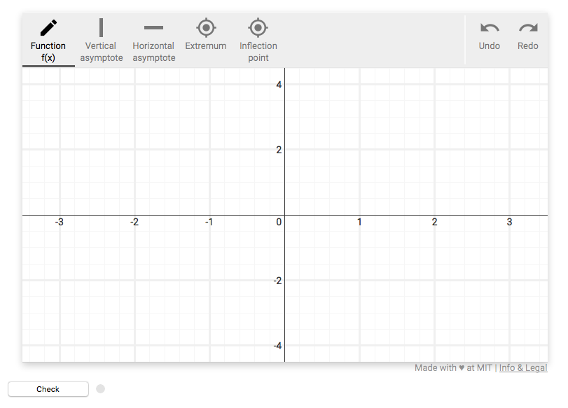

# A more realistic grader script

This document will walk through the implementation of a grader script for
a more complicated problem than the [Simple Grader Tutorial](simple_grader.md) tutorial. The
problem description for this grader script is below.

<p>Sketch the function <i>f(x)</i> = <i>2x</i><sup>2</sup> / <i>x</i><sup>2</sup> - 1.</p>
<p>Label vertical and horizontal asymptotes, extrema, and inflection points.</p>

This problem will introduce new javascript drawing plugins to handle labeling
asymptotes and points and some new backend API functions that can be used to
evaluate these new sources of data.

## Imports

There are three SketchResponse python modules that must be imported for this simple example. As you saw in the [Simple Grader Tutorial](simple_grader.md) all grader scripts must import the `sketchresponse` module. We again need to input the `GradeableFunction` module from `grader_lib`, but also need to import the `Asymptote` module
to support the asymptote labeling task.

```python
import sketchresponse
from grader_lib import GradeableFunction, Asymptote
```

## Problem configuration

The problem configuration is passed to the javascript front end to define the
size and scale of the drawing space and to define which drawing tools are
available for the problem. The `sketchresponse.config()` function takes a dict of
configuration options.

In the example configuration below, the first seven key/value pairs are required. In this configuration we increase the ranges of the X and Y axes compared to the [Simple Grader Tutorial](simple_grader.md):

* `'width': 750` sets the pixel width of the drawing space as 750 pixels
* `'height': 420` sets the pixel height of the drawing space to 420 pixels
* `'xrange': [-3.5, 3.5]` sets the numerical range of the x axis
* `'yrange': [-4.5, 4.5]` sets the numerical range of the y axis
* `'xscale': 'linear'` sets the scale of the x axis to linear (only option currently implemented)
* `'yscale': 'linear'` sets the scale of the y axis to linear (only option currently implemented)
* `'coordinates': 'cartesian' or 'polar'` sets the coordinate system used by the axes plugin to either cartesian or polar
* `'debug': True or False if True prints configuration debug information to the developer console

The last entry `'plugins'` takes a list of dicts that enable the specific javascript plugins that are available to the user. All plugins are declared by 'name'.

One key is optional:

* `'debug': <True|False>(default: False)` sets debug mode where the current configuration will be validated. If errors are found, information about these will ouput to the browser console and defaults will be loaded instead

The 'axes' and 'freeform' plugin usage here is identical to the [Simple Grader Tutorial](simple_grader.md) and is explained there as well as on the [Plugin Description Page](probconfig_plugins.md).

There are three new plugins introduced in this grading script: 'vertical-line', 'horizontal-line', and 'point'. The declaration of these plugins is very similar to the declaration of the 'freeform' plugin, however, each type of plugin has one additional parameter that needs to be defined: 'dashStyle' for the lines, and 'size' for the points.

The 'vertical-line' plugin entry enables the a labeling tool for vertical asymptotes. It has four configuration options to set:

* `'id'` sets the name of the argument of the grader callback function (described in the [next section](#grader)) to which the data generated by this plugin is passed.
* `'label'` is the name of the tool displayed to the user.
* `'color'` is the color used to render the drawn function.
* `'dashStyle'` is the style of dashed line to used to draw the asymptote.

The 'horizontal-line' plugin entry enables a labeling tool for horizontal asymptotes. Its configuration options mirror the 'vertical-line'.

In this problem, we want students to label both extrema points and the inflection point for the function. To do this we can declare two instances of the 'point' plugin with different 'id' and 'label' values. The 'point' plugin has four configuration options to set:

* `'id'` sets the name of the argument of the grader callback function (described in the [next section](#grader)) to which the data generated by this plugin is passed.
* `'label'` is the name of the tool displayed to the user.
* `'color'` is the color used to render the drawn function.
* `'size'` is the pixel width of the point drawn by the plugin.

A listing of all the built-in plugins can be found at [SketchResponse Plugins](probconfig_plugins.md).

```python
problemconfig = sketchresponse.config({
    'width': 750,
    'height': 420,
    'xrange': [-3.5, 3.5],
    'yrange': [-4.5, 4.5],
    'xscale': 'linear',
    'yscale': 'linear',
    'coordinates': 'cartesian',
    'debug': False,
    'plugins': [
        {'name': 'axes'},
        {'name': 'freeform', 'id': 'f', 'label': 'Function f(x)', 'color':'blue'},
        {'name': 'vertical-line', 'id': 'va', 'label': 'Vertical asymptote', 'color': 'gray', 'dashStyle': 'dashdotted'},
        {'name': 'horizontal-line', 'id': 'ha', 'label': 'Horizontal asymptote', 'color': 'gray', 'dashStyle': 'dashdotted'},
        {'name': 'point', 'id': 'cp', 'label': 'Extremum', 'color': 'black', 'size': 15},
        {'name': 'point', 'id': 'ip', 'label': 'Inflection point', 'color':'orange','size': 15}
    ]
})
```

The above problem configuration settings will create a javascript tool that looks something like the image below.



## Define the grader callback function
<div id=grader></div>

### Handling the input data

```python
@sketchresponse.grader
def grader(f,cp,ip,va,ha):

    f = GradeableFunction.GradeableFunction(f)
    cp = GradeableFunction.GradeableFunction(cp)
    va = Asymptote.VerticalAsymptotes(va)
    ha = Asymptote.HorizontalAsymptotes(ha)
    ip = GradeableFunction.GradeableFunction(ip)

    msg=''
```

The first thing that the grader function needs to do is format the input data so that [Grader Library API](https://SketchResponse.github.io/sketchresponse) methods of interest can be used to check specific features of the input data.

As explained in the [Simple Grader Tutorial](simple_grader.md) the data is passed to the grader function as a dictionary with keys equal to the 'id' values used in the pluginconfig above so the dictionary can be directly unpacked into argument variables with the same names.

The 'freeform' and 'point' data are evaluated with API methods in the `GradeableFunction.GradeableFunction` class. The 'vertical-line' and 'horizontal-line' data are evaluted with API methods in the `Asymptote.VerticalAsymptote` and 'Asymptote.HorizontalAsymptote` classes respectively.

The `msg` variable will be used when evaluating specific checks on the data to supply check specific feedback to the student if errors are found.

### Checking the number of extrema points labeled

```python
if cp.get_number_of_points() != 1:
   if cp.get_number_of_points() == 3:
      msg += '<font color="blue">Are you sure about the number of extrema? (note that you should not label the endpoints of your function)</font><br />'
   else:
	msg += '<font color="blue">Are you sure about the number of extrema?</font><br />'
```

This first check verifies that there is only one extremum point labeled in the input data. It also checks for a common error case where students label the end points of their function to provide more helpful feedback.

### Checking the number of inflection points

```python
if ip.get_number_of_points() != 0:
   msg += '<font color="blue">Are you sure about the number of extrema?</font><br />'
```

This particular function does not have any inflection points so this check verifies that the student did not put any unnecessary labels.

### Checking the number of asymptotes

```python
if va.get_number_of_asyms() != 2:
   msg += '<font color="blue"> Are you sure about the number of vertical asymptotes?</font><br />'


if ha.get_number_of_asyms() != 1:
   msg += '<font color="blue"> Are you sure about the number of horizontal asymptotes?</font><br />'
```

This function should have 2 vertical asymptote labels and 1 horizontal asymptote label. If either of theses checks fail, appropriate feedback messages are provided.

### Checking the position of the extremum point

```python
if not cp.has_point_at(x=0):
   msg += '<font color="blue"> Check the x value of your critical point</font><br />'
```

The extremum point label for the function should be at position `x=0`.

### Checking the positions of the asymptotes

```python
if not va.has_asym_at_value(-1) or not va.has_asym_at_value(1):
   v1 = va.closest_asym_to_value(-1)
   v2 = va.closest_asym_to_value(1)
   msg += '<font color="blue"> Check the locations of your vertical asymptotes.  </font><br />'

if not ha.has_asym_at_value(2):
   ha1 = ha.closest_asym_to_value(2)
   msg += '<font color="blue"> Check the locations of your horizontal asymptotes. </font><br />'
```

The vertical asymptotes should be at positions `x=-1` and `x=1`. The horizonal asymptote should be at the position `y=2`. As you can see, you can also get references to the actual asymptote values if you wanted to use them for further checks, or to customize your feedback messages.

### Checking that the extremum point is on the freeform line

```python
maxpt = cp.get_point_at(x=0)

if not f.has_value_y_at_x(maxpt.y, maxpt.x):
   msg += '<font color="blue"> Make sure your critical points lie on your function!</font><br />'
```

Here we get a reference to the extremum point and use that point's x and y coordinates to make sure that it is sitting on the freeform line of the function. The grader method does use a configurable threshold value to ensure pixel perfect placement is not necessary to pass this kind of check.

### Checking the increasing and decreasing ranges of the freeform line

```python
increasing_ok = f.is_increasing_between(-4, -1) and f.is_increasing_between(-1, 0)
decreasing_ok = f.is_decreasing_between(0, 1) and f.is_decreasing_between(1, 4)
if not (increasing_ok and decreasing_ok):
   msg += '<font color="blue"> Where should the graph be increasing and decreasing?</font><br />'
```

The freeform line drawn by the student should be increasing over the ranges `(-4,-1)` and `(-1,0)`. It should also be decreasing over the ranges `(0,1)` and `(1,4)`. Again these grading methods have configurable thresholds to ensure they don't unfairly fail student input.

### Checking the value of the freeform line over specific ranges

```python
if not f.is_greater_than_y_between(2,-4,-1):
   msg += '<font color="blue"> Your function seems to be in the wrong region on the interval (-4,-1)</font><br />'

if not f.is_greater_than_y_between(2,1,4):
   msg += '<font color="blue"> Your function seems to be in the wrong region on the interval (1,4)</font><br />'

if not f.is_less_than_y_between(0,-1,1):
   msg += '<font color="blue"> Your function seems to be in the wrong region on the interval (-1,1)</font><br />'
```

Here we are performing three sanity checks on the values of the freeform line over specific ranges. First, we check that `f(x) >= 2` over the range `(-4,-1)`. Second, we check that `f(x) >= 2` over the range `(1,4)`. Lastly, we check that `f(x) <= 0` over the range `(-1,1)`.

### Checking the curvature of the freeform line

```python
curvature_up_ok = f.has_positive_curvature_between(-4, -1) and f.has_positive_curvature_between(1, 4)
curvature_down_ok= f.has_negative_curvature_between(-1,1)

if not (curvature_up_ok and curvature_down_ok):
   msg += '<font color="blue"> Where is the function convave up and concave down?</font><br />'
```

The final checks we will perform make sure that the freeform line has the expected curvature over specific ranges. The curvature should be positive over the ranges `(-4,-1)` and `(1,4)`. The curvature should be negative over the range `(-1,1)`.

### Putting it all together
Combining all the code above into a single function gives us the following. You will notice that the error message variable `msg` is tested at multiple points during the evaluation and used as an early failure condition. If the numbers of expected labels are not correct, then future checks are likely to not be able to run on the data so returning early ensures the student gets good feedback.

```python
import sketchresponse
from grader_lib import GradeableFunction, Asymptote

problemconfig = sketchresponse.config({
    'width': 750,
    'height': 420,
    'xrange': [-3.5, 3.5],
    'yrange': [-4.5, 4.5],
    'xscale': 'linear',
    'yscale': 'linear',
    'coordinates': 'cartesian',
    'debug': False,
    'plugins': [
        {'name': 'axes'},
        {'name': 'freeform', 'id': 'f', 'label': 'Function f(x)', 'color':'blue'},
        {'name': 'vertical-line', 'id': 'va', 'label': 'Vertical asymptote', 'color': 'gray', 'dashStyle': 'dashdotted'},
        {'name': 'horizontal-line', 'id': 'ha', 'label': 'Horizontal asymptote', 'color': 'gray', 'dashStyle': 'dashdotted'},
        {'name': 'point', 'id': 'cp', 'label': 'Extremum', 'color': 'black', 'size': 15},
        {'name': 'point', 'id': 'ip', 'label': 'Inflection point', 'color':'orange','size': 15}
    ]
})

@sketchresponse.grader
def grader(f,cp,ip,va,ha):

    f = GradeableFunction.GradeableFunction(f)
    cp = GradeableFunction.GradeableFunction(cp)
    va = Asymptote.VerticalAsymptotes(va)
    ha = Asymptote.HorizontalAsymptotes(ha)
    ip = GradeableFunction.GradeableFunction(ip)

    msg=''

    if cp.get_number_of_points() != 1:
        if cp.get_number_of_points() == 3:
            msg += '<font color="blue">Are you sure about the number of extrema? (note that you should not label the endpoints of your function)</font><br />'
        else:
            msg += '<font color="blue">Are you sure about the number of extrema?</font><br />'


    if ip.get_number_of_points() != 0:
        msg += '<font color="blue">Are you sure about the number of extrema?</font><br />'

    if va.get_number_of_asyms() != 2:
        msg += '<font color="blue"> Are you sure about the number of vertical asymptotes?</font><br />'


    if ha.get_number_of_asyms() != 1:
        msg += '<font color="blue"> Are you sure about the number of horizontal asymptotes?</font><br />'

    if msg != '':
        return False, msg
    else:
        if not cp.has_point_at(x=0):
            msg += '<font color="blue"> Check the x value of your critical point</font><br />'
        if not va.has_asym_at_value(-1) or not va.has_asym_at_value(1):
            v1 = va.closest_asym_to_value(-1)
            v2 = va.closest_asym_to_value(1)
            msg += '<font color="blue"> Check the locations of your vertical asymptotes.  </font><br />'

        if not ha.has_asym_at_value(2):
            ha1 = ha.closest_asym_to_value(2)
            msg += '<font color="blue"> Check the locations of your horizontal asymptotes. </font><br />'

        maxpt = cp.get_point_at(x=0)

        if not f.has_value_y_at_x(maxpt.y, maxpt.x):
            msg += '<font color="blue"> Make sure your critical points lie on your function!</font><br />'

        increasing_ok = f.is_increasing_between(-4, -1) and f.is_increasing_between(-1, 0)
        decreasing_ok = f.is_decreasing_between(0, 1) and f.is_decreasing_between(1, 4)
        curvature_up_ok = f.has_positive_curvature_between(-4, -1) and f.has_positive_curvature_between(1, 4)
        curvature_down_ok= f.has_negative_curvature_between(-1,1)


        if not (increasing_ok and decreasing_ok):
            msg += '<font color="blue"> Where should the graph be increasing and decreasing?</font><br />'

        if not f.is_greater_than_y_between(2,-4,-1):
            msg += '<font color="blue"> Your function seems to be in the wrong region on the interval (-4,-1)</font><br />'

        if not f.is_greater_than_y_between(2,1,4):
            msg += '<font color="blue"> Your function seems to be in the wrong region on the interval (1,4)</font><br />'

        if not f.is_less_than_y_between(0,-1,1):
            msg += '<font color="blue"> Your function seems to be in the wrong region on the interval (-1,1)</font><br />'


        if not (curvature_up_ok and curvature_down_ok):
            msg += '<font color="blue"> Where is the function convave up and concave down?</font><br />'

    if msg == '':
        return True,'Good Job'
    else:
        return False, msg
```

## Testing the script

Once the script is written, you can run the script in the local testing server. See the [Test a Grading Script on a Local Server](local_test.md) tutorial for details on installing and running the testing server.

There is already a copy of this grader script in the `grader_scripts` directory so all you need to do is start the server and point your browser of choice to the url:

```
http://localhost:5000/complex_grader
```

You should see the configured Sketch Tool. If you sketch the function shown at the beginning of this tutorial, you should see an accept message. Any other sketches should return a reject message.