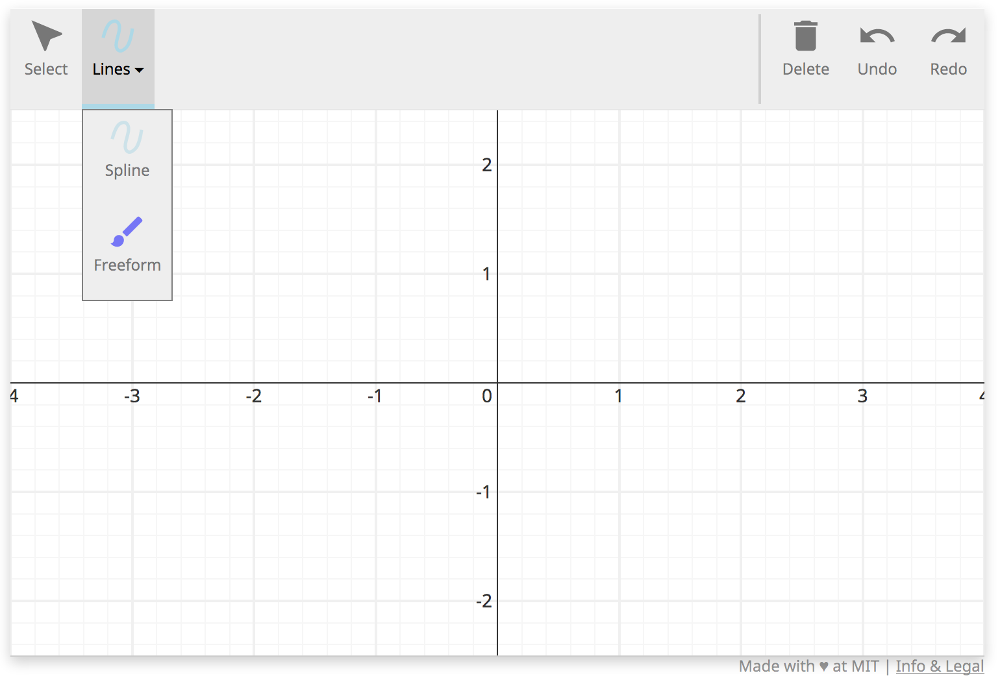

# A grader script that handles grouped plugins

This document will walk through the implementation of a grader script to
handle data from a plugin group. This script will not actually grade anything,
just demonstrate how to get plugin group data into a gradeable form.

Each grader script at its base is composed of two components

     1. The problem configuration
     2. The grader function

## Imports

There are two SketchResponse python modules that must be imported for this simple example. All grader scripts must import the `sketchresponse` module. There are two other modules that provide different grading helper functions. In this case, we only need to input the `GradeableFunction` module from `grader_lib`.

```python
import sketchresponse
from grader_lib import GradeableFunction
```

## Problem configuration

The problem configuration is passed to the javascript front end to define the
size and scale of the drawing space and to define which drawing tools are
available for the problem. The `sketchresponse.config()` function takes a dict of
configuration options.

In the example configuration below, the first seven key/value pairs are required:

* `'width': 750` sets the pixel width of the drawing space as 750 pixels
* `'height': 420` sets the pixel height of the drawing space to 420 pixels
* `'xrange': [-2.35, 2.35]` sets the numerical range of the x axis
* `'yrange': [-1.15, 1.15]` sets the numerical range of the y axis
* `'xscale': 'linear'` sets the scale of the x axis to linear (only option currently implemented)
* `'yscale': 'linear'` sets the scale of the y axis to linear (only option currently implemented)
* `'coordinates': 'cartesian' or 'polar'` sets the coordinate system used by the axes plugin to either cartesian or polar
* `'debug': True or False if True prints configuration debug information to the developer console

The last entry `'plugins'` takes a list of dicts that enable the specific javascript plugins that are available to the user. All plugins are declared by 'name'.

The 'axes' plugin entry is the simplest plugin to enable. It has no mandatory options so all that must be set is the 'name'. This plugin enables the axes in the drawing space. *It should probably be on by default no?*

The 'group' plugin lets you place multiple other plugins inside a single tool bar button that the user can switch between with a drop down menu. It has three configuration options to set:

* `'id'` sets the name of the argument of the grader callback function (described in the [next section](#grader)) to which the data generated by this plugin is passed.
* `'label'` is the name of the tool displayed to the user.
* `'plugins'` is the list of plugin declarations that are to be placed in this group.

The 'freeform' plugin and 'spline' plugin entries enables the freeform drawing tool and the spline drawing tool in the dropdown menu.

A listing of all the built-in plugins can be found at [SketchResponse Plugins](probconfig_plugins.md).

```python
problemconfig = sketchresponse.config({
    'width': 750,
    'height': 420,
    'xrange': [-4, 4],
    'yrange': [-2.5, 2.5],
    'xscale': 'linear',
    'yscale': 'linear',
    'coordinates': 'cartesian',
    'debug': False,
    'plugins': [
        {'name': 'axes'},
        {'name': 'group', 'id': 'grp', 'label': 'Lines', 'plugins': [
        {'name': 'spline', 'id': 'pg', 'label': 'Spline', 'color': 'lightblue', 'tag': {'value': 'tag', 'xoffset': 15, 'yoffset': 15, 'align': 'start'}},
        {'name': 'freeform', 'id': 'f', 'label': 'Freeform', 'color': 'blue', 'dashStyle': 'dashdotted', 'tag': {'value': 'tag', 'xoffset': 15, 'yoffset': 15, 'align': 'start'}}
        ]}
    ]
})
```

The above problem configuration settings will create a javascript tool that looks something like the image below.



## Define the grader callback function
<div id=grader></div>

```python
@sketchresponse.grader
def grader(grp, f):  # Only have to declare the plugins you want to grade.

    lines = GradeableFunction.GradeableFunction(grp)
    function = GradeableFunction.GradeableFunction(f)

    # Can now grade data either from individual plugins or handle multiple
    # plugins with comparable data through the group

    return True, "Good job!"
```

The grader callback function implements the function passed to the sketchinput
grader to evaluate the data sent from the javascript tool.

The arguments of the grader function are the `'id'` values as defined in the
problem configuration above. E.g. in our problem configuration we enabled the group
plugin with id 'grp', the spline plugin with id 'pg', and the 
freeform drawing tool with id 'f' and we have a corresponding argument f in
the signature of the function that will be automatically unpacked.

Notice in this example that we can receive they data from a plugin either through
its group id, or its individual plugin id. Here we are only interested in the data
from the entire plugin group and from the freeform tool individually.

Before we can execute any grading helper functions on the data, we must
instantiate the data as a `GradeableFunction`.

In this example we are not actually evaluting the input data.
The full API documentation for the
grader helper functions can be found at [SketchResponse API](https://SketchResponse.github.io/sketchresponse).

And that's it! Those two simple blocks of code complete our group plugin grader script.
Check out the other grader examples for a more realistic grader tutorial on an
example problems.

## Testing the script

Once the script is written, you can run the script in the local testing server. See the [Test a Grading Script on a Local Server](local_test.md) tutorial for details on installing and running the testing server.

There is already a copy of this grader script in the `grader_scripts` directory so all you need to do is start the server and point your browser of choice at the url:

```
http://localhost:5000/groups_grader
```

You should see the configured Sketch Tool. If you draw a straight(ish) line and press the check button you will get accept message. If the line is not straight enough, you will get a reject message.