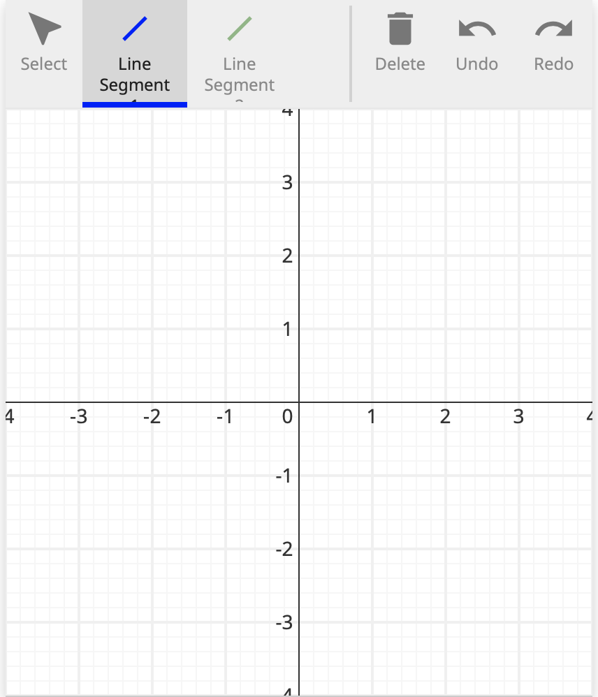

# A simple grader script

This document will walk through the implementation of a grader script for
a line segment problem. Unlike other input types, Line Segements can be graded
as a spline like any other freeform drawn input, or with the `LineSegment` module,
which provides API functions for interacting with end points among other things.

Each grader script at its base is composed of two components

     1. The problem configuration
     2. The grader function

## Imports

There are three SketchResponse python modules that must be imported for this simple example. All grader scripts must import the `sketchresponse` module. There are two other modules that provide different grading helper functions. In this case, we only need to input the `GradeableFunction` and the `LineSegment` modules from `grader_lib`.

```python
from sketchresponse import sketchresponse
from sketchresponse.grader_lib import GradeableFunction
from sketchresponse.grader_lib import LineSegment
```

## Problem configuration

The problem configuration is passed to the javascript front end to define the
size and scale of the drawing space and to define which drawing tools are
available for the problem. The `sketchresponse.config()` function takes a dict of
configuration options.

In the example configuration below, the first seven key/value pairs are required:

* `'width': 750` sets the pixel width of the drawing space as 750 pixels
* `'height': 420` sets the pixel height of the drawing space to 420 pixels
* `'xrange': [-2.35, 2.35]` sets the numerical range of the x axis
* `'yrange': [-1.15, 1.15]` sets the numerical range of the y axis
* `'xscale': 'linear'` sets the scale of the x axis to linear (only option currently implemented)
* `'yscale': 'linear'` sets the scale of the y axis to linear (only option currently implemented)
* `'coordinates': 'cartesian' or 'polar'` sets the coordinate system used by the axes plugin to either cartesian or polar
* `'debug': True or False if True prints configuration debug information to the developer console

The last entry `'plugins'` takes a list of dicts that enable the specific javascript plugins that are available to the user. All plugins are declared by 'name'.

The 'axes' plugin entry is the simplest plugin to enable. It has no mandatory options so all that must be set is the 'name'. This plugin enables the axes in the drawing space. *It should probably be on by default no?*

The 'freeform' plugin entry enables the freeform drawing tool. It has three configuration options to set:

* `'id'` sets the name of the argument of the grader callback function (described in the [next section](#grader)) to which the data generated by this plugin is passed.
* `'label'` is the name of the tool displayed to the user.
* `'color'` is the color used to render the drawn function.

A listing of all the built-in plugins can be found at [SketchResponse Plugins](probconfig_plugins.md).

```python
problemconfig = sketchresponse.config({
    'width': 420,
    'height': 420,
    'xrange': [-4, 4],
    'yrange': [-4, 4],
    'xscale': 'linear',
    'yscale': 'linear',
    'coordinates': 'cartesian',
    'plugins': [
        {'name': 'axes'},
        {'name': 'line-segment', 'id': 'ls1', 'label': 'Line Segment 1', 'color':'blue'},
        {'name': 'line-segment', 'id': 'ls2', 'label': 'Line Segment 2', 'color':'green'},
    ]
})
```

The above problem configuration settings will create a javascript tool that looks something like the image below.



## Define the grader callback function
<div id=grader></div>

```python
@sketchresponse.grader
def grader(ls1, ls2):

    gls = GradeableFunction.GradeableFunction(ls1)
    
    if not gls.is_straight():
        return False, "not straight"


    ls = LineSegment.LineSegments(ls2)

    if not ls.get_number_of_segments() == 1:
       return False, "ls2 doesn't have 1 segment"

    segment = ls.segments[0]

    if not ls.check_segment_startpoint(segment, (-2,-2)) or not ls.check_segment_endpoint(segment, (2,2)):
        return False, "start and/or end point is wrong"

    if not ls.has_slope_m_at_x(1, 0, ignoreDirection=True):
        return False, "slopes are wrong"

    return True, "Works"
```

The grader callback function implements the function passed to the sketchinput
grader to evaluate the data sent from the javascript tool.

The arguments of the grader function are the `'id'` values as defined in the
problem configuration above. E.g. in our problem configuration we enabled two
line segment drawing tools with ids 'ls1' and 'ls2' and we have a corresponding arguments
ls1 and ls2 in the function signature that will be automatically unpacked.

There are two different ways to evaluate the input data. We can either use the `GradeableFunction` module similar to any freeform spline function. Alternatively, we can use the `LineSegment` module, which contains a small collection of helper functions that assume the input is specifically a line segment defined by only two points.

First we use `GradeableFunction` to evaluate the ls1 input data.

In this simple example all we are checking is that the submitted function
defines a straight line over its entire domain. However, any `GradeableFunction` grader
functions can be called on this data since it is represented internally as a spline.
The full API documentation for the grader helper functions can be found at [SketchResponse API](https://SketchResponse.github.io/sketchresponse).

Second, we use the `LineSegment` module to evaluate the ls2 input data.

In this example, we check that there is a single line segment drawn using the `get_number_of_segments` function. Then we check that the start and end points of that line segment are in expected locations with the `check_segment_startpoint` and `check_segment_endpoint` functions. Finally we check the slope use the `has_slope_m_at_x` function. Note: the slope function for line segments has an optional parameter `ignoreDirection` that can be set to true if you don't care which endpoint is the first drawn.

And that's it! Those two simple blocks of code complete our line segment grader script.

## Testing the script

Once the script is written, you can run the script in the local testing server. See the [Test a Grading Script on a Local Server](local_test.md) tutorial for details on installing and running the testing server.

There is already a copy of this grader script in the `grader_scripts` directory so all you need to do is start the server and point your browser of choice at the url:

```
http://localhost:5000/linesegment_grader
```

You should see the configured Sketch Tool. If you draw a any line segment(s) with the blue line segment tool and a single line segment with the green line segment tool from [-2, -2] to [2, 2] it will pass. 