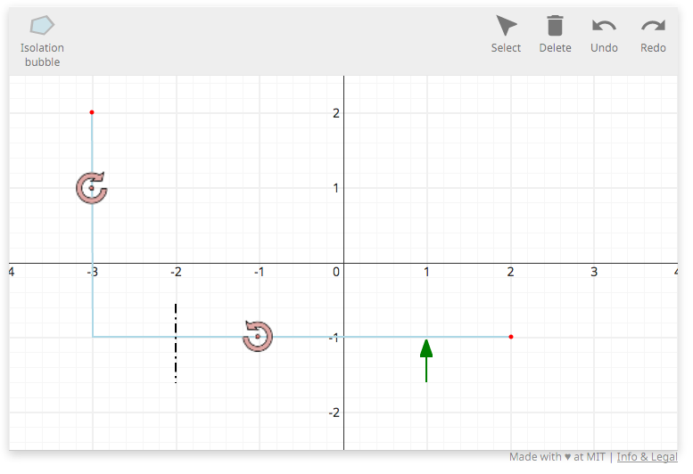

# A physics problem

This document will walk through the implementation of a grader script for
a more complicated problem than the [Simple Grader Tutorial](simple_grader.md) tutorial. The
problem description for this grader script is below.

<p>Draw an isolation bubble on the free body diagram.</p> 

This problem will introduce new javascript drawing plugins to handle drawing polylines, polygons, line segments, and image stamps and some new backend API functions that can be used to
evaluate these new sources of data.

## Imports

There are five SketchResponse python modules that must be imported for this example. As you saw in the [Simple Grader Tutorial](simple_grader.md) all grader scripts must import the `sketchresponse` module. We again need to input the `GradeableFunction` module from `grader_lib`, but also need to import the `LineSegment`, `PolyLine`, and `Polygon` modules.

```python
import sketchresponse
from grader_lib import GradeableFunction, LineSegment, PolyLine, Polygon
```

## Problem configuration

The problem configuration is passed to the javascript front end to define the
size and scale of the drawing space and to define which drawing tools are
available for the problem. The `sketchresponse.config()` function takes a dict of
configuration options.

In the example configuration below, the first seven key/value pairs are required. In this configuration we increase the ranges of the X and Y axes compared to the [Simple Grader Tutorial](simple_grader.md):

* `'width': 750` sets the pixel width of the drawing space as 750 pixels
* `'height': 420` sets the pixel height of the drawing space to 420 pixels
* `'xrange': [-4, 4]` sets the numerical range of the x axis
* `'yrange': [-2.5, 2.5]` sets the numerical range of the y axis
* `'xscale': 'linear'` sets the scale of the x axis to linear (only option currently implemented)
* `'yscale': 'linear'` sets the scale of the y axis to linear (only option currently implemented)
* `'coordinates': 'cartesian' or 'polar'` sets the coordinate system used by the axes plugin to either cartesian or polar. It defaults to 'cartesian'.
* `'debug': True or False if True prints configuration debug information to the developer console

The last entry `'plugins'` takes a list of dicts that enable the specific javascript plugins that are available to the user. All plugins are declared by 'name'.

The 'axes' and 'freeform' plugin usage here is identical to the [Simple Grader Tutorial](simple_grader.md) and is explained there as well as on the [Plugin Description Page](probconfig_plugins.md).

There are three new plugins introduced in this grading script: 'polyline', 'line-segment', and 'stamp'. The declaration of these plugins is very similar to the declaration of the 'freeform' plugin, however, each type of plugin has additional parameters that need to be defined. This script also introduces the use of 'intialstate' data to pre-populate the canvas with data to help define the problem.

The 'polyline' plugin entry enables the a tool to draw either a multi-segment polyline, or a polygon depending on its configuration. In this problem we are using a polyline to intialize beam object and a polygon that the students will use to draw an isolation bubble. It has five or size configuration options to set here:

* `'id'` sets the name of the argument of the grader callback function (described in the [next section](#grader)) to which the data generated by this plugin is passed.
* `'label'` is the name of the tool displayed to the user.
* `'color'` is the color used to render the drawn line segments.
* `'closed'` if True draws renders a polygon, if False renders a polyline
* `'fillColor'` sets the fill color if 'closed' is set to True
* `'readonly'` if True disables the plugin on the toolbar, but can still be used to draw initial state data.

The 'line-segment' plugin entry enables a drawing tool for line segments. In this example we are using one line segment to initialize a mark on one of the beams, and another line segment that labels the forces in the intial state of the freebody diagram. Its configuration in this example uses six or seven configuration parameters.

* `'id'` sets the name of the argument of the grader callback function (described in the [next section](#grader)) to which the data generated by this plugin is passed.
* `'label'` is the name of the tool displayed to the user.
* `'color'` is the color used to render the drawn line segments.
* `'dashStyle'` is the style of dashed line to used to draw the asymptote.
* `'lengthConstraint'` sets the maximum length of the segment in pixels.
* `'readonly'` if True disables the plugin on the toolbar, but can still be used to draw initial state data.
* `'arrowHead'` optionally sets the length and width of an arrowhead on one end of the line segment.
* `'tag'` optionally enables a string label for each line segment drawn

In this problem, we want to label clockwise and counter-clockwise moments in the initial state of the freebody diagram. To do this we can declare two instances of the 'stamp' plugin with different 'id' and 'label' values. The 'stamp' plugin has five configuration options to set:

* `'id'` sets the name of the argument of the grader callback function (described in the [next section](#grader)) to which the data generated by this plugin is passed.
* `'label'` is the name of the tool displayed to the user.
* `'scale'` is a decimal value to scale the size of the source image.
* `'src'` is a path to the source image to use for the stamp.
* `'readonly'` if True disables the plugin on the toolbar, but can still be used to draw initial state data.

The final new feature introduced in this example is the `'initialstate'` configuration parameter. This parameter can be used to supply a set of data values to be drawn to the canvas automatically using any of the configured plugins. The data can be automatically generated using the [local testing server](local_test.md).

This example uses the 'point' plugin, but introduces the 'tag' parameter, which can be optionally included with any plugin that draws to the canvas. It adds a string label to each point drawn.

A listing of all the built-in plugins can be found at [SketchResponse Plugins](probconfig_plugins.md).

```python
problemconfig = sketchresponse.config({
    'width': 750,
    'height': 420,
    'xrange': [-4, 4],
    'yrange': [-2.5, 2.5],
    'xscale': 'linear',
    'yscale': 'linear',
    'coordinates': 'cartesian',
    'debug': False,
    'plugins': [
        {'name': 'axes'},
        {'name': 'polyline', 'id': 'pl', 'label': 'Beam', 'closed': False, 'color': 'lightblue', 'readonly': True},
        {'name': 'polyline', 'id': 'pg', 'label': 'Isolation bubble', 'closed': True, 'color': 'gray', 'fillColor': 'lightblue'},
        {'name': 'point', 'id': 'pt', 'label': 'Point', 'color': 'red', 'size': 5, 'hollow': False, 'readonly': True, 'tag': {'value': 'tag', 'xoffset': 5, 'yoffset': -5, 'align': 'start'}},
        {'name': 'line-segment', 'id': 'ls', 'label': 'Force', 'color': 'green', 'dashStyle': 'solid', 'lengthContraint': 50, 'arrowHead': {'length': 10, 'base': 7}, 'readonly': True},
        {'name': 'line-segment', 'id': 'c', 'label': 'Segment', 'color': 'black', 'dashStyle': 'dashdotted', 'lengthContraint': 20, 'readonly': True, 'tag': {'value': 'tag', 'xoffset': 5, 'yoffset': 5, 'align': 'start', 'position': 'middle'}},
        {'name': 'stamp', 'id': 'cwm', 'label': 'CWM', 'scale': 0.5, 'src': '/static/examples/cw_moment.png', 'readonly': True},
        {'name': 'stamp', 'id': 'ccwm', 'label': 'CCWM', 'scale': 0.5, 'src': '/static/examples/ccw_moment.png', 'readonly': True}
    ],
    'initialstate': {
  "pl": [
    [
      {
        "y": 41,
        "x": 93
      },
      {
        "y": 293,
        "x": 94
      },
      {
        "y": 293,
        "x": 563
      }
    ],
    []
  ],
  "pt": [
    {
      "y": 41,
      "x": 93,
      "tag": "A"
    },
    {
      "y": 293,
      "x": 563,
      "tag": "B"
    }
  ],
  "ls": [
    {
      "y": 344,
      "x": 468
    },
    {
      "y": 296,
      "x": 468
    }
  ],
  "c": [
    {
      "y": 256,
      "x": 187,
      "tag": "C"
    },
    {
      "y": 345,
      "x": 187
    }
  ],
  "cwm": [
    {
      "y": 126,
      "x": 93
    }
  ],
  "ccwm": [
    {
      "y": 293,
      "x": 280
    }
  ]
}
})
```

The above problem configuration settings will create a javascript tool that looks something like the image below.



## Define the grader callback function
<div id=grader></div>

### Handling the input data

```python
@sketchresponse.grader
def grader(pl, pg, pt, ls, c, cwm, ccwm):

    pl = PolyLine.PolyLines(pl)
    pg = Polygon.Polygons(pg)
    cls = LineSegment.LineSegments(c)

    beam = pl.get_polyline_as_segments(0)
```

The first thing that the grader function needs to do is format the input data so that [Grader Library API](https://SketchResponse.github.io/sketchresponse) methods of interest can be used to check specific features of the input data.

As explained in the [Simple Grader Tutorial](simple_grader.md) the data is passed to the grader function as a dictionary with keys equal to the 'id' values used in the pluginconfig above so the dictionary can be directly unpacked into argument variables with the same names.

The 'polyline' data are evaluated with API methods in the `PolyLine.PolyLines` class, or the Polygon.Polygons class depending on if the plugin is configured 'closed' or not. The 'line-segment' data is evaluted with API methods in the `LineSegment.LineSegments`. The 'stamp' data is not evaluated in this problem, but is evaluated exactly like 'point' data using the `GradeableFunction.GradeableFunction` class.

### Checking the number of isolation bubbles drawn

```python
    if not pg.get_polygon_count() == 1:
        return False, "Did you forget the isolation bubble?"
```

This first check verifies that there is only one isolation bubble drawn in the input data.

### Checking the intersections of the isolation bubble with the beams

```python
    poly = pg.polygons[0]

    beam1 = beam.segments[0]
    beam2 = beam.segments[1]

    if len(pg.get_intersections_with_polygon_boundary(beam1, poly)) > 0:
        return False, "Isolation bubble should not cut vertical beam."

    if not len(pg.get_intersections_with_polygon_boundary(beam2, poly)) == 1:
        return False, "Isolation bubble should only cut the horizontal beam once."
```

There are two valid isolation bubbles that can be drawn for this problem. In both of them, the vertical beam should not be cut by the bubble and the horizontal beam should be cut at the point labeled C.

### Checking the beam points on the isolation bubble

```python
    if pg.point_is_on_boundary([-2, -1]) == None:
        return False, "Check where the isolation bubble cuts the horizontal beam."

    if pg.point_is_on_boundary([-3, 2]) == None and pg.point_is_on_boundary([2, -1]) == None:
        return False, "Check the isolation bubble containment."
```

The correct isolation bubbles will have the point C on the horizontal beam on the boundary of the bubble. It will also have either the top endpoint of the vertical beam, A, or the right end point of the horizontal beam, B, on the bubble's boundary.

### All checks passed, so return True

```python
    return True, "Good job!"
```

### Putting it all together
Combining all the code above into a single function gives us the following. You will notice that the error conditions are tested at multiple points during the evaluation and used as an early failure condition. If the numbers of expected bubbles is not correct, then future checks are likely to not be able to run on the data so returning early ensures the student gets meaningful feedback.

```python
import sketchresponse
from grader_lib import GradeableFunction, LineSegment, PolyLine, Polygon

problemconfig = sketchresponse.config({
    'width': 750,
    'height': 420,
    'xrange': [-4, 4],
    'yrange': [-2.5, 2.5],
    'xscale': 'linear',
    'yscale': 'linear',
    'coordinates': 'cartesian',
    'debug': False,
    'plugins': [
        {'name': 'axes'},
        {'name': 'polyline', 'id': 'pl', 'label': 'Beam', 'closed': False, 'color': 'lightblue', 'readonly': True},
        {'name': 'polyline', 'id': 'pg', 'label': 'Isolation bubble', 'closed': True, 'color': 'gray', 'fillColor': 'lightblue'},
        {'name': 'point', 'id': 'pt', 'label': 'Point', 'color': 'red', 'size': 5, 'hollow': False, 'readonly': True, 'tag': {'value': 'tag', 'xoffset': 5, 'yoffset': -5, 'align': 'start'}},
        {'name': 'line-segment', 'id': 'ls', 'label': 'Force', 'color': 'green', 'dashStyle': 'solid', 'lengthContraint': 50, 'arrowHead': {'length': 10, 'base': 7}, 'readonly': True},
        {'name': 'line-segment', 'id': 'c', 'label': 'Segment', 'color': 'black', 'dashStyle': 'dashdotted', 'lengthContraint': 20, 'readonly': True, 'tag': {'value': 'tag', 'xoffset': 5, 'yoffset': 5, 'align': 'start', 'position': 'middle'}},
        {'name': 'stamp', 'id': 'cwm', 'label': 'CWM', 'scale': 0.5, 'src': '/static/examples/cw_moment.png', 'readonly': True},
        {'name': 'stamp', 'id': 'ccwm', 'label': 'CCWM', 'scale': 0.5, 'src': '/static/examples/ccw_moment.png', 'readonly': True}
    ],
    'initialstate': {
  "pl": [
    [
      {
        "y": 41,
        "x": 93
      },
      {
        "y": 293,
        "x": 94
      },
      {
        "y": 293,
        "x": 563
      }
    ],
    []
  ],
  "pt": [
    {
      "y": 41,
      "x": 93,
      "tag": "A"
    },
    {
      "y": 293,
      "x": 563,
      "tag": "B"
    }
  ],
  "ls": [
    {
      "y": 344,
      "x": 468
    },
    {
      "y": 296,
      "x": 468
    }
  ],
  "c": [
    {
      "y": 256,
      "x": 187,
      "tag": "C"
    },
    {
      "y": 345,
      "x": 187
    }
  ],
  "cwm": [
    {
      "y": 126,
      "x": 93
    }
  ],
  "ccwm": [
    {
      "y": 293,
      "x": 280
    }
  ]
}
})

@sketchresponse.grader
def grader(pl, pg, pt, ls, c, cwm, ccwm):

    pl = PolyLine.PolyLines(pl)
    pg = Polygon.Polygons(pg)
    cls = LineSegment.LineSegments(c)

    beam = pl.get_polyline_as_segments(0)

    if not pg.get_polygon_count() == 1:
        return False, "Did you forget the isolation bubble?"

    poly = pg.polygons[0]

    beam1 = beam.segments[0]
    beam2 = beam.segments[1]

    if len(pg.get_intersections_with_polygon_boundary(beam1, poly)) > 0:
        return False, "Isolation bubble should not cut vertical beam."

    if not len(pg.get_intersections_with_polygon_boundary(beam2, poly)) == 1:
        return False, "Isolation bubble should only cut the horizontal beam once."

    if pg.point_is_on_boundary([-2, -1]) == None:
        return False, "Check where the isolation bubble cuts the horizontal beam."

    if pg.point_is_on_boundary([-3, 2]) == None and pg.point_is_on_boundary([2, -1]) == None:
        return False, "Check the isolation bubble containment."

    return True, "Good job!"
```

## Testing the script

Once the script is written, you can run the script in the local testing server. See the [Test a Grading Script on a Local Server](local_test.md) tutorial for details on installing and running the testing server.

There is already a copy of this grader script in the `grader_scripts` directory so all you need to do is start the server and point your browser of choice to the url:

```
http://localhost:5000/physics_grader
```

You should see the configured Sketch Tool. If you sketch the function shown at the beginning of this tutorial, you should see an accept message. Any other sketches should return a reject message.