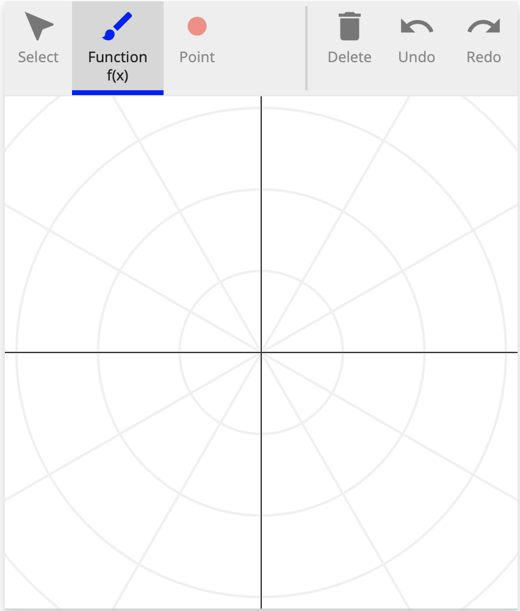

# A polar-coordinates grader script

This document will walk through the implementation of a grader script for
a simple problem using polar coordinates. All this grader will do is test whether the
input function is of a straight line and a point has been place on the correct angle.

Each grader script at its base is composed of two components

     1. The problem configuration
     2. The grader function

## Imports

There are two SketchResponse python modules that must be imported for this simple example. All grader scripts must import the `sketchresponse` module. There are two other modules that provide different grading helper functions. In this case, we only need to input the `GradeableFunction` module from `grader_lib`. Because we are dealing with polar coordinates, we also want to import `pi` from the
standard python `math` module.

```python
from sketchresponse import sketchresponse
from sketchresponse.grader_lib import GradeableFunction
from math import pi
```

## Problem configuration

The problem configuration is passed to the javascript front end to define the
size and scale of the drawing space and to define which drawing tools are
available for the problem. The `sketchresponse.config()` function takes a dict of
configuration options.

In the example configuration below, the first seven key/value pairs are required:

* `'width': 750` sets the pixel width of the drawing space as 750 pixels
* `'height': 420` sets the pixel height of the drawing space to 420 pixels
* `'xrange': [-2.35, 2.35]` sets the numerical range of the x axis
* `'yrange': [-1.15, 1.15]` sets the numerical range of the y axis
* `'xscale': 'linear'` sets the scale of the x axis to linear (only option currently implemented)
* `'yscale': 'linear'` sets the scale of the y axis to linear (only option currently implemented)
* `'coordinates': 'cartesian' or 'polar'` sets the coordinate system used by the axes plugin to either cartesian or polar
* `'debug': True or False if True prints configuration debug information to the developer console

The last entry `'plugins'` takes a list of dicts that enable the specific javascript plugins that are available to the user. All plugins are declared by 'name'.

The 'axes' plugin entry is the simplest plugin to enable. It has no mandatory options so all that must be set is the 'name'. This plugin enables the axes in the drawing space. *It should probably be on by default no?*

The 'freeform' plugin entry enables the freeform drawing tool. It has three configuration options to set:

* `'id'` sets the name of the argument of the grader callback function (described in the [next section](#grader)) to which the data generated by this plugin is passed.
* `'label'` is the name of the tool displayed to the user.
* `'color'` is the color used to render the drawn function.

A listing of all the built-in plugins can be found at [SketchResponse Plugins](probconfig_plugins.md).

```python
problemconfig = sketchresponse.config({
    'width': 420,
    'height': 420,
    'xrange': [-pi, pi],
    'yrange': [-pi, pi],
    'xscale': 'linear',
    'yscale': 'linear',
    'coordinates': 'polar', # This setting enables polar coordinates
    'debug': False,
    'plugins': [
        {'name': 'axes'},
	{'name': 'freeform', 'id': 'f', 'label': 'Function f(x)', 'color':'blue'},
	{'name': 'point', 'id': 'p', 'label': 'Point', 'color': 'red', 'size': 15},
    ]
})
```

The above problem configuration settings will create a javascript tool that looks something like the image below. Note that setting the coordinates parameter to 'polar' changes the background axes.



## Define the grader callback function
<div id=grader></div>

```python
@sketchresponse.grader
def grader(f, p):
    gf = GradeableFunction.GradeableFunction(f)
    gp = GradeableFunction.GradeableFunction(p)
    
    if not gf.is_straight():
        return False, 'Not straight'

    if not gp.has_point_at(x=pi / 4):
        return False, 'Missing point at PI/4'

    return True, 'Good Job'
```

The grader callback function implements the function passed to the sketchinput
grader to evaluate the data sent from the javascript tool.

The arguments of the grader function are the `'id'` values as defined in the
problem configuration above. E.g. in our problem configuration we enabled the
freeform drawing tool with id 'f' and the point drawing tool with id 'p'.
Therefore, we have a corresponding arguments f and p in the grader function
signature that will be automatically unpacked.

Before we can execute any grading helper functions on the data, we must
instantiate the data as a `GradeableFunction`. When you instantiate polar
coordinate data as a GradeableFunction, the data is automatically transformed
from a polar coordinate space to a cartesian coordinate space. The data is also
duplicated over the full range [-2PI, 2PI]. This allows us
to use all of the existing grading functionality that we would have access to
in a cartesian space problem.

In this example all we only making two checks. First, that the submitted function
defines a straight line over its entire domain, which corresponds to a circle
in the polar coordinate space. We are not checking for slope of the line, though it should be horizontal in cartesian space.
To do this we call the grader helper function `gf.is_straight()`.
`is_straight()` returns a boolean value. The full API documentation for the
grader helper functions can be found at [SketchResponse API](https://SketchResponse.github.io/sketchresponse).

Second, we are testing that there is a point drawn with an
x coordinate equal to PI/4, which corresponds to a point being placed with an angular
coordinate of PI/4 in the polar coordiante space. To do this we call the grader helper
function `gp.has_point_at(x=pi / 4)`. This function also returns a boolean value.

And that's it! Those two simple blocks of code complete our first polar coordinate grader script.

## Testing the script

Once the script is written, you can run the script in the local testing server. See the [Test a Grading Script on a Local Server](local_test.md) tutorial for details on installing and running the testing server.

There is already a copy of this grader script in the `grader_scripts` directory so all you need to do is start the server and point your browser of choice at the url:

```
http://localhost:5000/polar_grader
```

You should see the configured Sketch Tool. If you draw a circular(ish) line, place a point with an angular coordinate of PI/4(ish) and press the check button you will get accept message. If the line is not circular enough, or the point is too far off angle you will get a reject message.